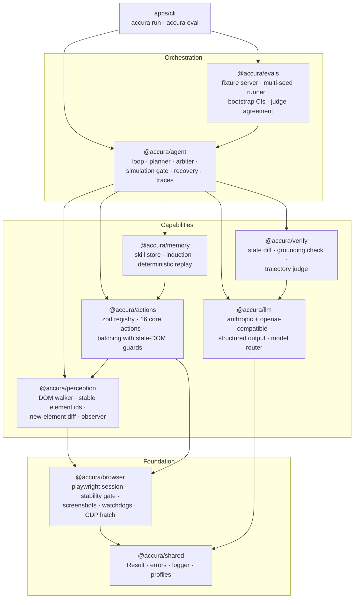
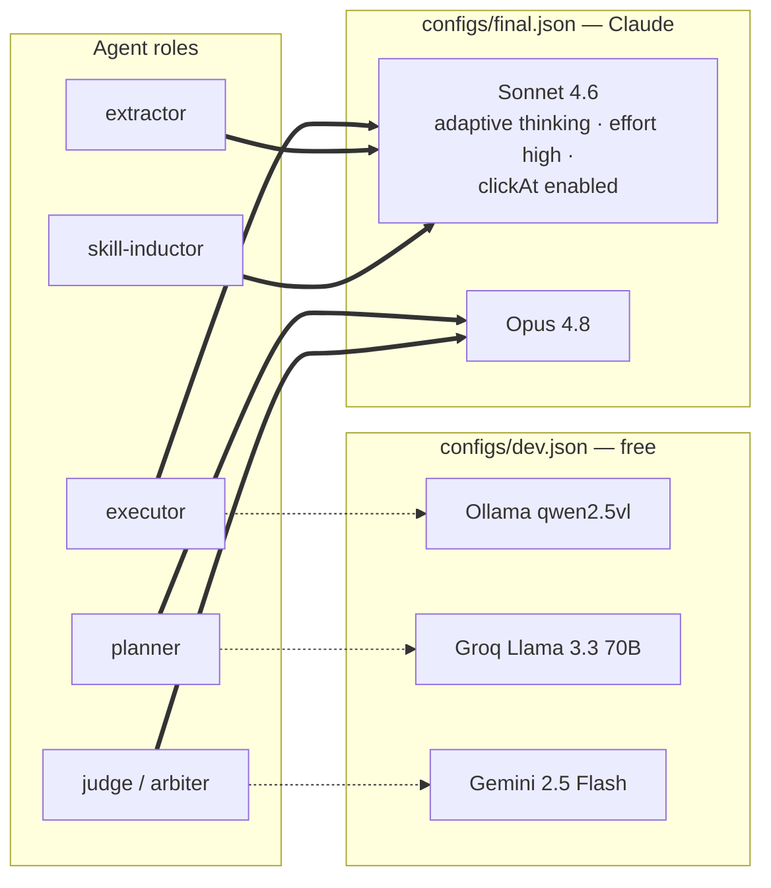

# Accura

An accuracy-first browser agent. TypeScript, Playwright, model-agnostic —
develop on free models, run on Claude.

Accura optimizes one metric: **task success rate**. Latency is explicitly not
a constraint, so the architecture spends time wherever it buys correctness:
it re-observes after every action, verifies every step, samples multiple
candidates at uncertain decisions, simulates irreversible actions before
running them, and refuses to declare success it cannot prove.

## Quickstart (Docker — recommended)

The complete stack — API server, web console, the agent's chromium, and
Postgres — runs in containers:

```sh
docker compose up --build
# console at http://localhost:7700  ·  Postgres at localhost:5434
```

Multi-user mode is automatic: with `DATABASE_URL` set (compose does this),
run history and the shared skill memory live in Postgres with
concurrent-writer-safe updates, and the console's history survives restarts.
Model keys pass through from your shell: `ANTHROPIC_API_KEY`, `GROQ_API_KEY`,
`GEMINI_API_KEY`.

## Quickstart (local, single-user)

```sh
pnpm install
pnpm --filter @accura/browser exec playwright install chromium
pnpm build

# run a task (dev profile: local/free models)
node apps/cli/dist/main.js "Find the price of the Super Widget" --url https://example.com --profile dev

# run the eval suite
node apps/cli/dist/main.js eval packages/evals/suites/fixtures.json --profile dev --seeds 3
```

Profiles live in `configs/`. `dev.json` targets free models (Ollama
`qwen2.5vl`, Groq, Gemini free tier); `final.json` targets Claude
(Sonnet 4.6 executor with adaptive thinking, Opus 4.8 planner/judge) and
needs `ANTHROPIC_API_KEY`. Same code, same prompts — the profile is the
only difference.

## Architecture

Design rationale and the research behind every decision:
[ARCHITECTURE.md](./ARCHITECTURE.md).

### System overview



### One agent step, end to end


### Model roles per profile



Capability flags degrade gracefully: a non-vision executor gets DOM-only
observations; only coordinate-grounded models (Claude) get the `clickAt`
fallback action.

### The five accuracy mechanisms

1. **Clean enumerated action space** (`perception`) — the model picks from
   stable indexed element ids and never invents selectors. The single
   highest-leverage change in the published evidence (AgentOccam, +26.6 pts).
2. **Verification everywhere** (`verify`) — a deterministic state diff after
   every step, a "your actions succeeded but nothing changed" contradiction
   check, and a two-layer `done` gate: code-level grounding of claimed values,
   then a skeptical key-point judge. Attacks the #1 measured failure mode:
   confident false success.
3. **Hard recovery rules** (`agent`) — an identical action that failed twice
   is blocked in code, not just prompted away; stuck-detection forces a
   strategy change.
4. **Test-time spending** (`agent`) — best-of-3 with an arbiter at flagged
   decisions only; outcome simulation before irreversible actions. Latency is
   the currency, accuracy the purchase.
5. **Compounding memory** (`memory`) — verified successes are distilled into
   text-grounded recipes; later runs replay them deterministically and fall
   back to the live executor at the first mismatch (AWM/SkillWeaver, +31–51%
   relative).

Everything is measured by `evals` (multi-seed runs, bootstrap 95% CIs,
judge-agreement tracking) — no accuracy claim without numbers.

## Packages

| Package | What it does |
|---|---|
| `@accura/shared` | Result type, errors, logging, zod-validated model profiles |
| `@accura/llm` | Provider-agnostic ChatModel (Anthropic SDK + any OpenAI-compatible endpoint), structured output with repair reprompts, role-based model router |
| `@accura/browser` | Playwright session: stability gate, exact-dimension screenshots, popup/dialog/download/crash watchdogs, CDP escape hatch |
| `@accura/perception` | In-page walker → enumerated interactive elements with stable ids, new-element diffing, id→element resolution |
| `@accura/actions` | Zod-validated action registry, 16 core actions, multi-action batching with stale-DOM guards |
| `@accura/verify` | State-diff step verifier, deterministic data-grounding check, skeptical trajectory judge |
| `@accura/agent` | The loop: planner, best-of-N arbiter, simulation gate, recovery policy, done gating, JSONL traces |
| `@accura/memory` | Cross-run skills: induction from verified successes, deterministic replay with live fallback, scoring/retirement |
| `@accura/evals` | Task suites, multi-seed runner, bootstrap CIs, judge-agreement harness, failure clustering |
| `@accura/store` | Postgres persistence: run history + event log, shared skill memory with concurrent-writer-safe scoring |
| `apps/server` | Fastify API: run queue, SSE live streaming, Postgres hydration, serves the console |
| `apps/web` | The console UI: submit tasks, watch runs live, browse history |
| `apps/cli` | `accura "<task>"` and `accura eval <suite>` |

## Status

All 8 build phases are implemented and tested (~120 tests, including
browser-integration tests against real Chromium and full-pipeline e2e runs
with scripted oracle models). Pending items that require live model access:

- dev-profile baseline numbers (`packages/evals/REPORTS/README.md`)
- final-profile benchmark on Claude (`--profile final`, needs `ANTHROPIC_API_KEY`)

## Development

```sh
pnpm build      # turbo build across the workspace
pnpm test       # unit + browser integration tests
pnpm lint       # eslint
pnpm typecheck  # tsc --noEmit
```

One branch per phase, merged to `main` after its exit criteria pass; see git
history.
