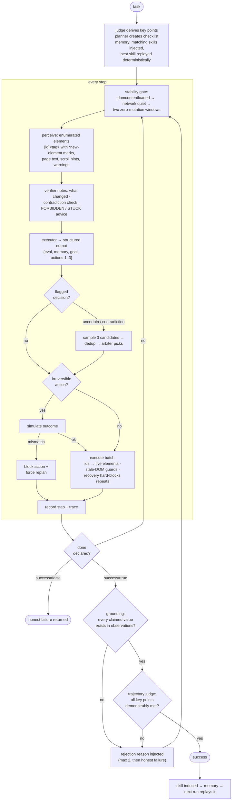
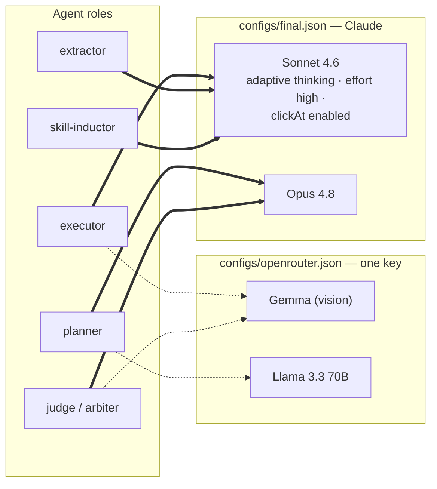

<p align="center">
  
</p>

# Accura

An accuracy-first browser agent. TypeScript, Playwright, model-agnostic —
runs on Claude or any OpenAI-compatible API (OpenRouter, …) via external API
calls.

Accura optimizes one metric: **task success rate**. Latency is explicitly not
a constraint, so the architecture spends time wherever it buys correctness:
it re-observes after every action, verifies every step, samples multiple
candidates at uncertain decisions, simulates irreversible actions before
running them, and refuses to declare success it cannot prove.

## Quickstart

```sh
pnpm install
pnpm --filter @accura/browser exec playwright install chromium
pnpm build

# run a task on Claude (needs ANTHROPIC_API_KEY)
node apps/cli/dist/main.js "Find the price of the Super Widget" --url https://example.com --profile final

# run the eval suite
node apps/cli/dist/main.js eval packages/evals/suites/fixtures.json --profile final --seeds 3
```

Model keys come from your shell, or a local `.env` loaded with
`node --env-file=.env …`. Profiles live in `configs/` — **every role is an
external API call; no local model hosting**:

- **`final.json`** — Claude (Sonnet 4.6 executor with adaptive thinking, Opus 4.8
  planner/judge). Needs `ANTHROPIC_API_KEY`.
- **`openrouter.json`** — every role through a single `OPENROUTER_API_KEY`.

Same code, same prompts — the profile is the only difference.

> Running your own models locally (Ollama) and the full self-hosted platform —
> API server, web console, and Postgres — live on the
> [`self-hosted`](https://github.com/vimalyad/accura/tree/self-hosted) branch.

## Architecture

Design rationale and the research behind every decision:
[ARCHITECTURE.md](./ARCHITECTURE.md).

### System overview


### One agent step, end to end



### Model roles per profile



Capability flags degrade gracefully: a non-vision executor gets DOM-only
observations; only coordinate-grounded models (Claude) get the `clickAt`
fallback action.

### The five accuracy mechanisms

1. **Clean enumerated action space** (`perception`) — the model picks from
   stable indexed element ids and never invents selectors. The single
   highest-leverage change in the published evidence (AgentOccam, +26.6 pts).
2. **Verification everywhere** (`verify`) — a deterministic state diff after
   every step, a "your actions succeeded but nothing changed" contradiction
   check, and a two-layer `done` gate: code-level grounding of claimed values,
   then a skeptical key-point judge. Attacks the #1 measured failure mode:
   confident false success.
3. **Hard recovery rules** (`agent`) — an identical action that failed twice
   is blocked in code, not just prompted away; stuck-detection forces a
   strategy change.
4. **Test-time spending** (`agent`) — best-of-3 with an arbiter at flagged
   decisions only; outcome simulation before irreversible actions. Latency is
   the currency, accuracy the purchase.
5. **Compounding memory** (`memory`) — verified successes are distilled into
   text-grounded recipes; later runs replay them deterministically and fall
   back to the live executor at the first mismatch (AWM/SkillWeaver, +31–51%
   relative).

Everything is measured by `evals` (multi-seed runs, bootstrap 95% CIs,
judge-agreement tracking) — no accuracy claim without numbers.

## Packages

| Package | What it does |
|---|---|
| `@accura/shared` | Result type, errors, logging, zod-validated model profiles |
| `@accura/llm` | Provider-agnostic ChatModel (Anthropic SDK + any OpenAI-compatible endpoint), structured output with repair reprompts, role-based model router |
| `@accura/browser` | Playwright session: stability gate, exact-dimension screenshots, popup/dialog/download/crash watchdogs, CDP escape hatch |
| `@accura/perception` | In-page walker → enumerated interactive elements with stable ids, new-element diffing, id→element resolution |
| `@accura/actions` | Zod-validated action registry, 17 core actions (incl. `doubleClick`), multi-action batching with stale-DOM guards |
| `@accura/verify` | State-diff step verifier, deterministic data-grounding check, skeptical trajectory judge |
| `@accura/agent` | The loop: planner, best-of-N arbiter, simulation gate, recovery policy, done gating, JSONL traces |
| `@accura/memory` | Cross-run skills: induction from verified successes, deterministic replay with live fallback, scoring/retirement |
| `@accura/evals` | Task suites, multi-seed runner, bootstrap CIs, judge-agreement harness, failure clustering |
| `apps/cli` | `accura "<task>"` and `accura eval <suite>` |

## Status

The agent and CLI are implemented and tested — unit tests plus
browser-integration tests against real Chromium and full-pipeline end-to-end
runs. Verified end-to-end on the `final` (Claude) profile.

## Development

```sh
pnpm build      # turbo build across the workspace
pnpm test       # unit + browser integration tests
pnpm lint       # eslint
pnpm typecheck  # tsc --noEmit
```

One branch per phase, merged to `main` after its exit criteria pass; see git
history.
